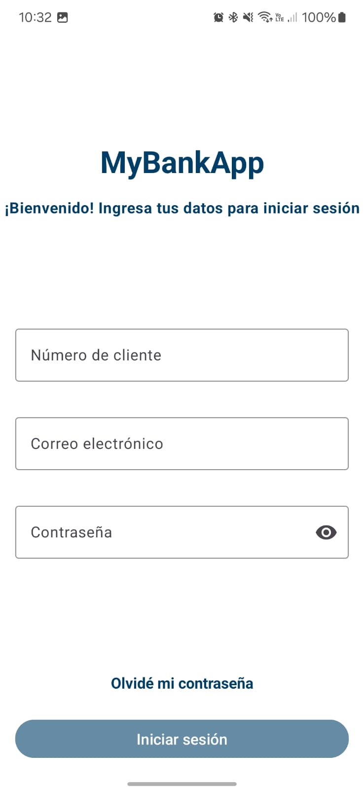
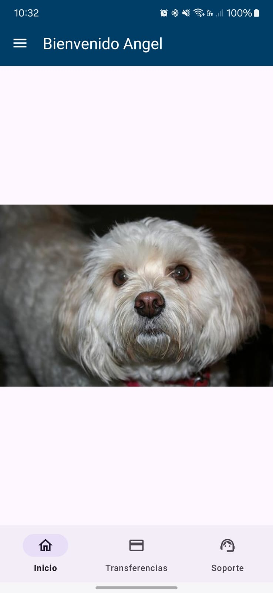
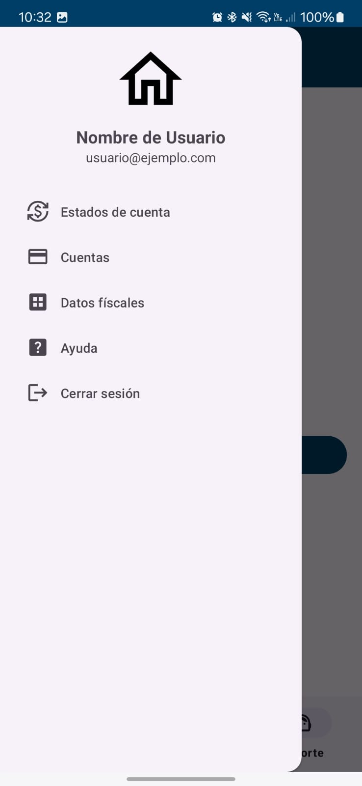

# MyAppBank

¡Bienvenido a MyAppBank! 🎉

MyAppBank es una aplicación que te permite  y descubrir información sobre tus personajes favoritos de Disney. Con una interfaz intuitiva y un diseño atractivo, puedes buscar personajes, ver detalles, y más.

## Tecnologías Utilizadas

- **Lenguaje**: Kotlin
- **Gestión de dependencias**: Dagger Hilt
- **Arquuitectura**: MVVM
- **Clean Code**
- **Networking**: Retrofit
- **Imágenes**: Retrofit
- **Animaciones**: Lottie
- 
## Características

- Navegación fácil e intuitiva
- Una vez que te logeas entras en automático
- Imagenes divertidas en el home cada que lo abres

## Capturas de Pantalla
| Ingreso de sesión                               | Home                                          | Transferencias                            | Support                               | Menú Lateral                             |
|-------------------------------------------------|------------------------------------------------|-------------------------------------------|---------------------------------------|------------------------------------------|
|    |                 |  |   |  |

## Instalación

Para instalar MyAppBank, clona el repositorio y sigue estos pasos:

1. Abre Android Studio.
2. Selecciona "Import Project" y elige la carpeta del proyecto clonado.
3. Espera a que se sincronicen las dependencias.
4. Conecta tu dispositivo o inicia un emulador.
5. Ejecuta la aplicación.

## Uso

1. Abre la aplicación.
2. Ingresa.
3. Disfruta!

## Licencia

Este proyecto está bajo la [Licencia MIT](LICENSE).

## Contacto

Si tienes alguna pregunta o sugerencia, no dudes en contactarme mandandome un [correo](mailto:angel.angeles.molina@gmail.com).

---

¡Gracias por visitar MyAppBank! 🎈
